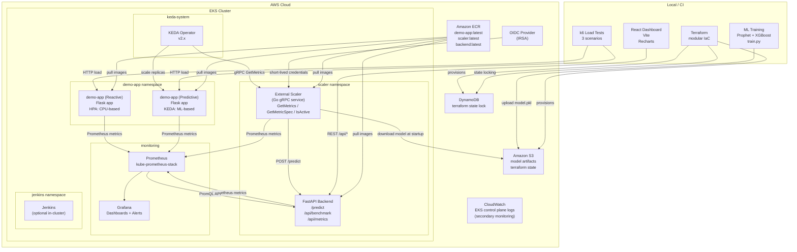

# Architecture — Horizontal Pod Scaler

## System Components

## Component Descriptions

### demo-app (Flask)
A simple Flask web service with two endpoints:
- `GET /` — returns `{"status": "ok"}` (minimal CPU)
- `GET /load?intensity=N` — busy-loops for N seconds to simulate CPU load
- `GET /health` — Kubernetes liveness/readiness probe

Deployed **twice** into EKS:
1. **Reactive** — standard `HorizontalPodAutoscaler` targeting 50% CPU utilization
2. **Predictive** — KEDA `ScaledObject` backed by the external gRPC scaler

### External Scaler (Go gRPC)
Implements the KEDA `ExternalScaler` gRPC service interface:
- `IsActive()` — returns `true` if predicted load exceeds the idle threshold
- `GetMetricSpec()` — declares the metric name and target value to KEDA
- `GetMetrics()` — calls the FastAPI `/predict` endpoint and returns the forecast as the current metric value

KEDA's operator polls `GetMetrics` on its evaluation interval (default: 30s) and adjusts replica count accordingly.

### FastAPI Backend
Central data plane for the dashboard and the scaler:
- `POST /predict` — accepts recent metric window, returns load forecast + confidence interval
- `GET /api/benchmark/results` — returns aggregated CSV/JSON benchmark data
- `GET /api/metrics/live` — Server-Sent Events stream of live replica counts
- `GET /metrics` — Prometheus scrape endpoint (via prometheus-fastapi-instrumentator)

Loads the trained model from S3 at startup (or local filesystem in `DEV_MODE`).

### Terraform Modules

| Module | Key Resources |
|--------|--------------|
| `vpc` | VPC, 2 public + 2 private subnets (2 AZs), IGW, NAT gateway |
| `eks` | EKS cluster, managed node group, OIDC provider (for IRSA) |
| `ecr` | 3 ECR repos: demo-app, scaler, backend |
| `s3` | Model artifact bucket (versioned, AES-256 encrypted) |
| `iam` | EKS service role, node role, IRSA role for scaler pod |

**Remote state**: S3 bucket + DynamoDB table — prevents concurrent `terraform apply` from corrupting state.

### IRSA (IAM Roles for Service Accounts)
The scaler pod accesses S3 using short-lived credentials issued via OIDC federation:
1. EKS creates an OIDC provider endpoint
2. An IAM role trusts that OIDC provider for the `scaler/scaler-sa` service account
3. The K8s service account is annotated with the IAM role ARN
4. The AWS SDK in the scaler pod automatically exchanges the OIDC token for temporary credentials
5. No `AWS_ACCESS_KEY_ID` anywhere in the pod spec or environment

## Scaling Logic Comparison

| Dimension | Reactive HPA | Predictive KEDA |
|-----------|-------------|-----------------|
| Trigger | Current CPU > threshold | Forecast load > threshold |
| Lag | 30–90 seconds | Pre-scaled before traffic |
| Over-provisioning | Low (scales down fast) | Slight overhead during quiet periods |
| SLO impact | Latency spikes during ramp | Smooth latency curve |
| Complexity | Built-in K8s | KEDA + ML service |
